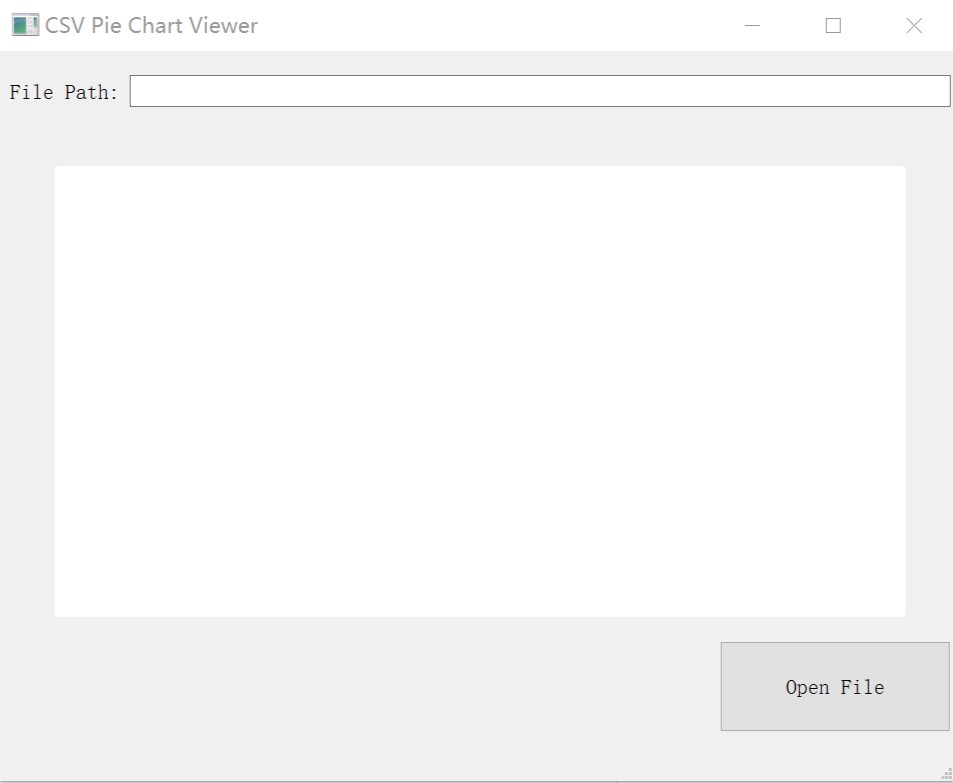

# Pie Chartviewer of CSV File

## Introduction

This GUI program can load a CSV file that is chosen by users, and it will draw a pie chart according to the data in chosen file. After you choose one file and it draw a picture, you can reclick the OpenFile button to open another file and draw another picture.  
**`NOTICE`**: The first row should be the description of data, such as country name or populaion(1k), do NOT put the data at the first raw.

## Environment

This program is developed in Qt5.13.2 and with the library QtCharts. Please make sure your Qt version is suitable and you have installed QtCharts library.

## How to Use

You should open the .pro file in QtCreator, and click the RUN button. After waiting for a while, you will see the GUI like this:

Click the OpenFile button and choose the CSV file you want to process, and you will see the pie chart in the middle. If you want to open another file, just click the OpenFile again to choose another file.
